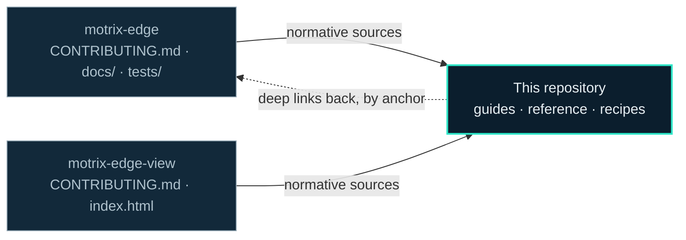

# Motrix Documentation

**DOCS** · The manual for both halves, in one place.

[](LICENSE)
[](.nvmrc)
[](package.json)
[](https://motrix-energy.github.io)

The documentation site for [Motrix Edge](https://github.com/Motrix-Energy/motrix-edge) and
[Motrix Edge View](https://github.com/Motrix-Energy/motrix-edge-view), published at
**[motrix-energy.github.io](https://motrix-energy.github.io)**. Astro + Starlight, dark-only, themed
with the Motrix "Modernist" design system.

29 pages across five sections: get started, understand the architecture, run it, contribute to it,
look something up. It is a *guide* to two repositories, never a second source of truth for them —
every normative claim lives in the code or in a repository's own `CONTRIBUTING.md`, and a page that
restates one links to it and says which is normative.



---

## Develop

Requires Node 22 (`.nvmrc`). Astro is pinned to v5 with Starlight 0.36 because Astro 6+ refuses Node
below 22.12 — once local Node is upgraded past that, both can be bumped to latest. Bump them
together; Starlight 0.37+ carries the same floor.

```sh
npm install
npm run dev        # http://localhost:4321 — search only works on built output
npm run build      # builds dist/ and runs Pagefind indexing
npm run preview    # serve dist/ — use this to test search
```

## Layout

| | |
|---|---|
| `src/content/docs/` | Every page. Five directories matching the five sidebar sections |
| `astro.config.mjs` | Sidebar, integrations, site metadata. A new page is not routed until it is listed here |
| `src/styles/theme.css` | The Modernist theme. Brand colours mirror `motrix-edge-view`'s `index.html` `:root` |
| `src/components/` | Overrides that enforce dark-only, plus `SystemDiagram.mdx` |
| `src/fonts/` | The vendored Archivo typeface |

Three conventions that are easy to trip over:

- **Dark-only is enforced, not defaulted.** `ThemeProvider` forces `data-theme=dark` and `ThemeSelect`
  is empty. Primary teal surfaces carry navy ink, never white.
- **Brand colours have one source**, and it is not this repository: `motrix-edge-view`'s `index.html`
  `:root` (navy `#0B1E2D`, teal `#2FE6C8`, amber `#FFB443`). `theme.css` mirrors them.
- **`astro-mermaid` must be listed before `starlight`** in `astro.config.mjs`, or diagrams render as
  code blocks.

## Contributing

The thing to know before editing: **this site links into the source repositories by anchor and by
path, and nothing in CI checks those links.** Both repos run their own tests and linters; neither
reaches across.

- Nine `CONTRIBUTING.md` headings in `motrix-edge` are linked from here, and nine in
  `motrix-edge-view`. Every `##` heading in both files is load-bearing as a URL fragment.
- `contribute/your-first-connector.md` cites the connector recipe **by step number**. Renumbering a
  step falsifies the citation without breaking the link — the page still loads and is simply wrong.
- Thirteen `tests/*.py` files are deep-linked by path, one of them from inside a heading.

So a rename in a source repository is a silent 404 or, worse, a silently false sentence here. When
you change one, grep this repository for it.

Avoid restating things. The dedup canon: the system diagram appears only via
`src/components/SystemDiagram.mdx`; the family table only on `start/what-is-motrix`; storage caveats
only on `reference/storage-format`; the nginx-auth doctrine only on `architecture/security`.
Everywhere else, one line and a link.

## Deploy

Pushing to `main` builds and deploys via `.github/workflows/deploy.yml`. One-time setup: repository
Settings → Pages → Source: **GitHub Actions**.

---

## The Motrix family

| | |
|---|---|
| **Motrix Edge** | [`motrix-edge`](https://github.com/Motrix-Energy/motrix-edge). The runtime — connectors, algorithms, supervision, storage. One site, local-first, no internet required. |
| **Motrix Edge View** | [`motrix-edge-view`](https://github.com/Motrix-Energy/motrix-edge-view). The viewer — Edge's two CSVs and its live REST state, on one synchronised timeline. |
| **This repository** | The documentation for both, published at [motrix-energy.github.io](https://motrix-energy.github.io). |

---

## License

Apache-2.0 — see [`LICENSE`](LICENSE) and [`NOTICE`](NOTICE). The vendored Archivo typeface is
licensed OFL-1.1 (`src/fonts/OFL.txt`).
