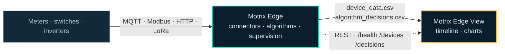

{/*
  The system diagram, adapted from the README shared by motrix-edge and
  motrix-edge-view. One source, imported wherever the picture is needed —
  do not paste a second copy of this diagram into a page.
*/}

