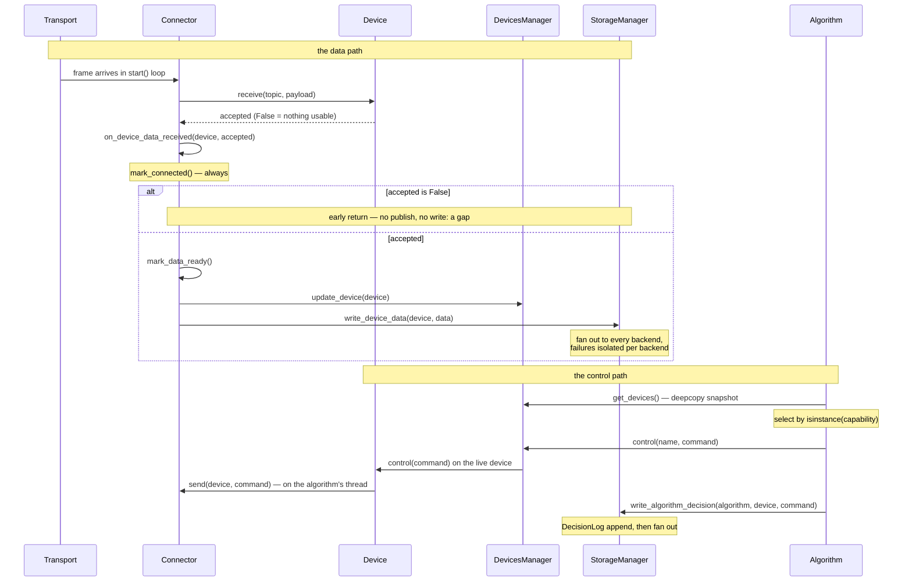

Two paths cross the runtime: the **data path**, where a frame on the wire becomes a reading that algorithms and storage can see, and the **control path**, where an algorithm's decision becomes a command back on the wire. Both are short, both are fixed, and knowing them by name is most of what debugging Motrix Edge amounts to.



## The data path

A connector's `start()` is a blocking loop that owns the transport. When a frame arrives, the connector looks up the target device — it received the name-to-device mapping at startup via `inject_devices()`, and per-device routing hints live in `device.listener_options` — and makes exactly two calls:

1. **`device.receive(...)`** parses the raw transport data into `self.data` and returns whether the payload produced a usable update. `False` means it did not — a CRC failure, a truncated frame, a topic the device does not model. `None` still counts as accepted, so a device written before this contract existed keeps working.
2. **`self.on_device_data_received(device, accepted)`**, passing exactly what `receive()` returned. This hook, defined in [`api/connector.py`](https://github.com/Motrix-Energy/motrix-edge/blob/main/api/connector.py), is where the framework takes over.

The hook does four things, in an order that is worth quoting the reasoning for:

- **Marks the device connected — always.** A payload arriving proves the transport is alive even when the payload is rubbish.
- **Returns early when `accepted` is `False`.** No publication, no storage write. **This is how a gap is recorded**: publishing a rejected payload would re-report the device's previous value under the new timestamp, turning a stalled or corrupt meter into a plausible flat line in storage instead of the missing data it actually is. Losing a sample is acceptable; inventing one is not.
- **Marks the device data-ready** — the event that algorithms' `required_devices` gate waits on.
- **Publishes the device to `DevicesManager` and fans the reading out to `StorageManager`.** Skip either call in a hand-rolled connector and algorithms never see the data — which is why the recipe says to use the hook rather than reimplement it.

`StorageManager` forwards each write to every configured backend and isolates failures per backend: a broken backend logs an error and the others carry on, because a storage backend is a side channel that must never take down the connector thread that was merely reporting a reading.

## The control path

Algorithms never see live devices. `super().main()` refreshes `self.devices` from `DevicesManager.get_devices()`, which returns **deepcopy snapshots** — an algorithm reads a device without racing the connector thread that writes it. (The copy deliberately shares the live connector reference and the readiness events; everything that is *data* is copied.)

Selection is by capability, never by class: `isinstance(device, EnergyMeter)` picks up every meter ever written, including next year's. When the algorithm decides to act, it calls `self.control_device(device, command)`, and the chain is:

```text
Algorithm.control_device
  → DevicesManager.control          # looks up the LIVE device by name
    → Device.control                 # refuses non-writable devices, else
      → Connector.send(device, cmd)  # back onto the wire
```

Two properties of this chain are load-bearing:

- **`send()` runs on the algorithm's thread.** Nothing in the chain above catches exceptions, so a raise inside `send()` crashes the algorithm's supervised worker — because a relay did not answer, or an operator typed a value the hardware cannot hold. A connector must catch everything it can inside `send()`, coercion included. This is footgun number two on [Connector patterns](/contribute/connector-patterns/).
- **The decision is recorded unconditionally.** `control_device` writes to storage after routing the command: `StorageManager.write_algorithm_decision` appends to the in-memory `DecisionLog` first — outside the backend fan-out, so `/decisions` works even with zero storage configured — then fans out to every backend. One funnel means `algorithm_decisions.csv` and the REST route hold the same decisions in the same order by construction.

## Storage is a published interface

The rows written at the end of the data path and the control path are not internal state. `device_data.csv` and `algorithm_decisions.csv` are parsed by Motrix Edge View, frozen by a versioned format contract, and pinned byte-for-byte by a golden fixture — see [Storage format 1.0](/reference/storage-format/) before assuming anything about their shape, and before changing anything that touches it.
