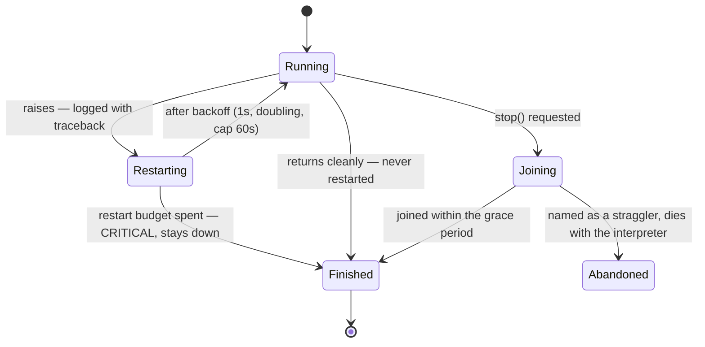

Every connector, algorithm and service runs in its own supervised daemon thread, and the runtime's whole lifecycle — crash, restart, completion, shutdown — is governed by a handful of rules small enough to fit on this page.

:::note[Canonical source]
The normative statement of these contracts is [CONTRIBUTING.md, "Contracts shared with the other axes"](https://github.com/Motrix-Energy/motrix-edge/blob/main/CONTRIBUTING.md#contracts-shared-with-the-other-axes); the implementation is [`supervisor/supervisor.py`](https://github.com/Motrix-Energy/motrix-edge/blob/main/supervisor/supervisor.py) and [`api/stoppable.py`](https://github.com/Motrix-Energy/motrix-edge/blob/main/api/stoppable.py).
:::

## Supervision: raise means restart, return means done

The supervisor distinguishes exactly two ways a worker's blocking method can end, and the distinction is a contract plugin authors write against:

- **Raising is a crash.** It is logged at ERROR with its traceback, then the worker is restarted with bounded exponential backoff. The policy comes from the config `runtime` block: `max_restarts` (default 5), `backoff_seconds` (default 1, doubling) capped at `max_backoff_seconds` (default 60). Past the cap the worker logs CRITICAL and stays down.
- **Returning is a normal completion** — a finished replay, an idle poller — logged at INFO and **never restarted**.

Keep that distinction in your own plugins: raise on failure, return when genuinely done. A restart re-invokes the method on the *same* object in the same thread, so state survives a restart — which is also why a crashed algorithm acks its replay step in a `finally`: the step it died on is finished, never re-run. Under a replay a crash costs time, never a timestep, as long as each backoff stays under the replay's `step_timeout_seconds`. The defaults do: the longest backoff is 16 s against a 30 s timeout. A longer one ends in the [loud timeout](/architecture/time-and-replay/), and the steps it overran are skipped. The crashed algorithm stays a participant of the [lockstep barrier](/architecture/time-and-replay/) through its backoff, so the replay waits at the next step for the restart instead of running ahead. When no restart is coming — the budget is spent, restarts are disabled, or the run is stopping — the supervisor calls the worker's `retire()` and the algorithm leaves the barrier, so a backtest is never stranded either.

## Liveness is connector-shaped

`main` waits on the **connector workers only**. When every connector has finished — a replay reached its last row, or a crashed transport spent its restart budget — the run shuts down, whatever else is still running.

A service therefore never keeps a run alive, by design: a server's `start()` never returns, so counting services towards liveness would hang every completed backtest forever. That is precisely why the read-only REST API is a fifth plugin axis rather than a `Connector` with stub methods. The corollary is worth knowing before you debug it: **a config with services and no connectors exits immediately**, with a warning saying so. To hold a process open while poking at a service, run a `pseudo` connector with `"loop": true`.

## Shutdown is cooperative

The framework never kills a thread; it asks. The `Stoppable` mixin gives every connector and algorithm three methods — `stop()` sets an event, `is_stopping()` polls it, `wait_stop(seconds)` is an interruptible sleep — and a well-behaved `start()` loops on `while not self.is_stopping():`, sleeping only through `wait_stop()`. A loop blocked somewhere an event cannot reach overrides `stop()` to unblock itself (always calling `super().stop()` first).

On `SIGTERM` or `SIGINT` the sequence is fixed:

1. The signal handler only sets an event — logging inside a signal handler could deadlock.
2. `stop()` is called on every worker, and all of them are joined within **one shared grace period**: `runtime.shutdown_timeout_seconds`, default 10s.
3. Workers still running when the grace expires are **named in a warning and abandoned** — they are daemon threads and die with the interpreter. Nothing hangs on them.
4. Only then `StorageManager.close_all()` runs, giving buffering backends their one chance to flush.

Algorithms get all of this for free — the base `loop()` is already cooperative — so only connectors and services with a custom blocking `start()` have anything to implement. The shutdown-ordering subtleties that bite in practice (a `stop()` arriving before `start()`, a library that raises `SystemExit`, a network client whose defaults outlive the grace period) are catalogued in the [storage and services recipe](/contribute/storage-and-services/) and the [connector patterns](/contribute/connector-patterns/) page.

## Where to next

- What the supervisor is restarting and why it loaded at all: [The plugin system](/architecture/plugins/).
- Restart counts and worker state, live: the `/workers` route on the [REST API](/reference/rest-api/).
- When shutdown misbehaves — stragglers, hangs, the InfluxDB 213-second story: [Troubleshooting](/operate/troubleshooting/).
