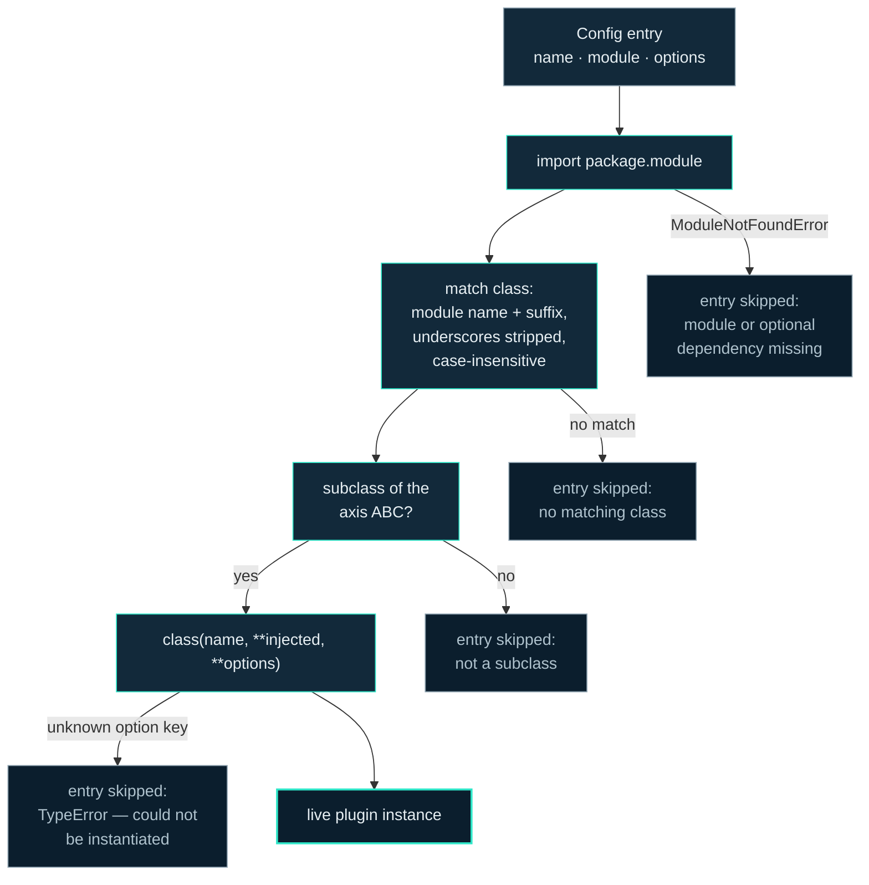

Motrix Edge has no plugin registry, no entry-point metadata and no central import list. A plugin is a Python module in the right package containing a class with the right name; a config entry names it and it loads. That is the whole mechanism, and it is deliberately small enough to hold in your head — this page is the complete description of it.

The loader is `Main.create_classes` in [`main.py`](https://github.com/Motrix-Energy/motrix-edge/blob/main/main.py), and it wires all five axes the same way: a config entry names a module, the module is imported from the axis's package, and a class inside it is matched by naming convention.

## The five axes

| Axis | Config array | Config key | Package | Class-name suffix | Example |
|---|---|---|---|---|---|
| Connector | `connectors` | `protocol` | `connectors/` | `Connector` | `mqtt` → `connectors/mqtt.py` → `MQTTConnector` |
| Device | `devices` | `kind` | `devices/` | *(none)* | `shelly_plug` → `devices/shelly_plug.py` → `ShellyPlug` |
| Algorithm | `algorithms` | `class` | `algorithms/` | *(none)* | `auto_toggle` → `algorithms/auto_toggle.py` → `AutoToggle` |
| Storage | `storage` | `class` | `storage/` | `Backend` | `csv_file` → `storage/csv_file.py` → `CsvFileBackend` |
| Service | `services` | `class` | `services/` | `Service` | `rest_api` → `services/rest_api.py` → `RestApiService` |

The table is reproduced from [CONTRIBUTING.md, "How plugins load"](https://github.com/Motrix-Energy/motrix-edge/blob/main/CONTRIBUTING.md#how-plugins-load), which is normative. What ships on each axis today is catalogued on the [plugin catalogue](/reference/plugin-catalog/) page.

## The naming rule

Take the module name, append the axis's suffix, strip the underscores, and match against the module's class names **case-insensitively**. So `connectors/foo_bar.py` must contain a class whose lowercased name is `foobarconnector` — i.e. `FooBarConnector`, though `FOOBarConnector` would match too. The matched class must subclass the axis's ABC (`api/connector.py`, `api/device.py`, `api/algorithm.py`, `api/storage_backend.py`, `api/service.py`) or it is rejected with a logged error.

Case-insensitivity is what lets snake_case module names carry ordinary CamelCase class names without a lookup table: the convention *is* the lookup table.

## The kwargs contract

This is the load-bearing rule of the whole system, quoted from `CONTRIBUTING.md`:

```python
actual_class(config_entry["name"], **config_entry.get("options", {}))
```

Every key in a config entry's `options` object is passed as a keyword argument to the constructor. **Your constructor signature *is* your options schema.** There is no separate declaration to keep in sync: an option exists because a parameter exists, a default exists because a Python default exists, and an unknown key raises `TypeError` — at which point that plugin is skipped with a *"could not be instantiated"* log line, and the rest of the run starts normally.

Two axes receive injected arguments before the options spread: algorithms get `devices_manager`, and services get `devices_manager` and `supervisor`. Declare and forward them, or your plugin is skipped by the same `TypeError` path — the loader does not special-case anything.

The corollary worth internalising early: because `**options` spreads straight into `__init__`, giving every optional option a default value is not a courtesy, it is what makes the option optional.

## Two-layer schema validation

Validation happens in two layers, and both are **warnings, never fatal** — a config that validates badly still attempts to load, because the constructor is the real gate and its `TypeError` is the real error message.

1. **[`config.schema.json`](https://github.com/Motrix-Energy/motrix-edge/blob/main/config.schema.json)** covers the document's *shape*: the five arrays, the `name`/`protocol`/`kind`/`class` keys, the `runtime` block.
2. **`<name>.schema.json` beside each plugin module** covers that plugin's *options*: `connectors/pseudo.schema.json` validates every connector entry whose `protocol` is `pseudo`, `devices/p1.schema.json` every device whose `kind` is `p1`, and so on. `tests/test_config.py` asserts each schema stays in lockstep with its constructor's signature.

The split is what keeps the loader decentralised: **adding a plugin never touches the root schema.** A plugin that ships no schema file simply gets no options validation — the kwargs contract still protects it.

Algorithms are the deliberate exception: they ship no options schema at all. Their constructor signature is the whole contract, enforced by `TypeError` at load time. The reasoning, and the config file's own structure, are covered on [Configuration](/operate/configuration/).

## What loading looks like, including the failures



Every failure branch is a **per-entry skip, never a run abort**. That is a design decision with a specific beneficiary: optional dependencies. A connector that needs `pymodbus` imports it at module top, so on a machine without the Modbus extra installed the import fails inside `create_classes`, which catches `ModuleNotFoundError` and logs one honest error line while the rest of the EMS starts. The same import placed inside a supervised `start()` would instead be a crash loop — restarts, backoff, then CRITICAL — over a dependency that was optional by design. The full footgun list lives on [Connector patterns](/contribute/connector-patterns/).

:::tip[Reading a skip]
If a plugin you configured is silently absent from a run, the log already told you why: look for *"could not be instantiated"* (bad or unknown option key), *"not found"* (module missing, optional dependency absent, or no class matched the naming rule), or *"is not a subclass"*. The [troubleshooting page](/operate/troubleshooting/) maps each line to its fix.
:::

## Instantiation order is config order

Plugins are instantiated into a list, never a set. Set iteration over instances is id-ordered, which once made devices reach the registry in an order that varied between runs of the same config — and with it the order an algorithm sees devices, and the order two decisions land in storage within one timestep. Config order is the deterministic order, everywhere.

## Where to go deeper

- Build one: [your first connector](/contribute/your-first-connector/) narrates the nine-step recipe end to end.
- The runtime contracts every axis shares — supervision, cooperative stop, liveness — are summarised on [Lifecycle](/architecture/lifecycle/).
- What each hook is called and when: [Data flow: wire to decision](/architecture/data-flow/).
