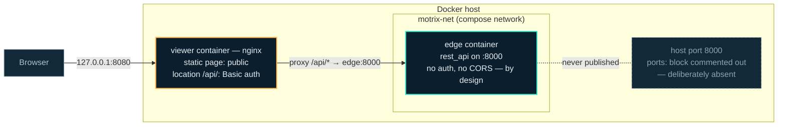

Motrix's security model is unusual in that it can be stated in one sentence, and the sentence is a doctrine the whole deployment is built around:

**The viewer's nginx is the only authentication in this system.** It gates `location /api/` with Basic auth and proxies to `edge:8000` across the compose network. That is why the Edge API port is deliberately not published, why the EMS ships no CORS middleware and no auth of its own, and why uncommenting the `ports:` block on `edge` puts an ungated copy of every route beside the gated one.

This page is the canonical home of that doctrine; everywhere else on this site it appears as one line and a link back here.

## The topology

The browser only ever sees one origin: the viewer's nginx on `127.0.0.1:8080`. The static page is public on purpose — it is the same file the viewer project publishes as a release download, and it holds no data. Everything the EMS's read-only API serves sits behind `location /api/`, which nginx gates with Basic auth and forwards to `edge:8000` over the internal compose network. Edge's port 8000 exists only *inside* that network.

## Why Edge ships no auth of its own

Not an omission — a construction. [`services/rest_api.py`](https://github.com/Motrix-Energy/motrix-edge/blob/main/services/rest_api.py) serves live device data and site topology unauthenticated, and that is safe for exactly one reason: nothing outside the compose network can reach it. One gate in one place is a security model you can audit; a second, half-hearted gate inside the EMS would be a second password store, a second CORS policy and a second thing to misconfigure. The service's own docstring names the trigger for changing this: *publish that port and authentication becomes the first thing to add here* — a condition that has not been met.

The corollary is the one operational rule that must never be broken casually. [`docker-compose.yml`](https://github.com/Motrix-Energy/motrix-edge/blob/main/docker-compose.yml) keeps the `ports:` block on `edge` commented out, and uncommenting it puts an unauthenticated copy of every route beside the gated one. If you do temporarily publish it while debugging, the `127.0.0.1:` prefix is not optional either — a bare `8000:8000` binds `0.0.0.0` and puts live device data and site topology on the LAN. Re-comment it when you are done.

Inside the compose deployment the API binds `0.0.0.0` (via `MOTRIX_API_HOST`), because each container has its own loopback and a loopback bind would be unreachable from the viewer container. The service logs a warning whenever it binds a non-loopback address, stating precisely what makes that safe here and unsafe anywhere else.

## The viewer container fails closed

The viewer image refuses to invent a credential. There is no default username or password baked in — an image that shipped one would have published the only password in the system. Instead:

- Both auth files are created at build time **in the gated state with an empty `.htpasswd`**, so an image whose startup hook never runs rejects everyone rather than admitting everyone.
- The startup hook ([`docker/docker-entrypoint.d/40-viewer-auth.sh`](https://github.com/Motrix-Energy/motrix-edge-view/blob/main/docker/docker-entrypoint.d/40-viewer-auth.sh)) **exits non-zero when `VIEWER_USER` or `VIEWER_PASSWORD` is missing or empty** — a `docker run` with no environment does not start at all.

The `admin`/`admin` you will see in Edge's compose file is a compose-side placeholder for the loopback quickstart, not an image default; override both variables in `.env` before the viewer leaves loopback. The full variable semantics are on [Using the viewer](/operate/viewer/).

:::caution[Basic auth is base64, not encryption]
The credentials travel reversibly encoded on every request. Over `127.0.0.1` that is fine — the traffic never leaves the machine. The moment you set `VIEWER_BIND` to `0.0.0.0`, the same header crosses the LAN in the clear: do that only deliberately, and put TLS or a VPN in front when you do. The container warns about exactly this at every start.
:::

## Secrets stay out of config files

`config.json` never holds a credential. Values are written as `${VAR}` (or `${VAR:-default}`) and resolved from the environment by `Config` after schema validation — see [Configuration](/operate/configuration/) for the mechanics and [Docker](/operate/docker/) for which variables are read where. A committed config file is therefore always safe to commit, which is the point.

## API payloads are explicit field allowlists

Every response the REST API builds names its fields explicitly — never `vars(obj)`, never an attribute walk. The reason is structural, not stylistic: a device snapshot deliberately shares the *live* connector object (control commands must reach the real transport), so any generic serialisation of a device would reach `MQTTConnector.password`. Device *data* is telemetry and may be exposed; device *options* are configuration and may hold credentials. The same rule binds every service you write — it is step six of the [service recipe](/contribute/storage-and-services/).

## The public-repo privacy rule

Both repositories are public, and the project carries a standing rule — normative for contributors in the viewer's [`CONTRIBUTING.md`](https://github.com/Motrix-Energy/motrix-edge-view/blob/main/CONTRIBUTING.md#standing-rule--this-repository-is-public), first stated in its [`CLAUDE.md`](https://github.com/Motrix-Energy/motrix-edge-view/blob/main/CLAUDE.md#standing-rule--this-repository-is-public) — that applies to every contribution, this documentation site included:

> Never put a customer name, a site topology, a real address or GPS coordinate, a broker host, a MAC address, a meter serial, or a non-English domain field name in this repository.

Sample data uses the shipped vocabulary — `p1_meter`, `shelly_plug`, `pseudo_sensor`, the `AutoToggle` algorithm — and fixtures are the ones Motrix Edge generates by running itself. Sites run private algorithms over private data; a repo that ships one operator's vocabulary has both leaked it and stopped being generic. Keep it in mind for every example, test fixture and screenshot you contribute — the [contribution workflow](/contribute/workflow/) restates it as a checklist item.

## Reporting a vulnerability

Both repositories carry a `SECURITY.md` — [motrix-edge](https://github.com/Motrix-Energy/motrix-edge/blob/main/SECURITY.md), [motrix-edge-view](https://github.com/Motrix-Energy/motrix-edge-view/blob/main/SECURITY.md) — and both take reports through GitHub's private vulnerability reporting, on the repository's **Security** tab. Never a public issue, and never a pull request with the fix attached. Redact your config and logs first: the standing rule above binds a security report exactly as it binds a commit.

Each file also lists what is *not* a vulnerability, and the entries follow from this page. The EMS shipping no authentication of its own is the model, not an omission; Basic auth being reversibly encoded over loopback is documented at every container start; and a deployment that publishes port 8000, or sets `VIEWER_BIND` to `0.0.0.0` without TLS, has changed the model by an operator decision the compose file warns about in place. What *is* in scope is anything that breaks a boundary this page claims exists — a route reachable without the gate in the shipped topology, a payload that serialises a device's `options` rather than its data, a credential reaching a log or a stored row, or anything that makes the viewer fetch from off-disk when opened from `file://`.

## Where to next

- The routes behind the gate, and their semantics: [REST API](/reference/rest-api/).
- Running the gated stack: [Docker and compose profiles](/operate/docker/).
- The viewer's side of the gate, including sign-in behaviour: [Using the viewer](/operate/viewer/).
