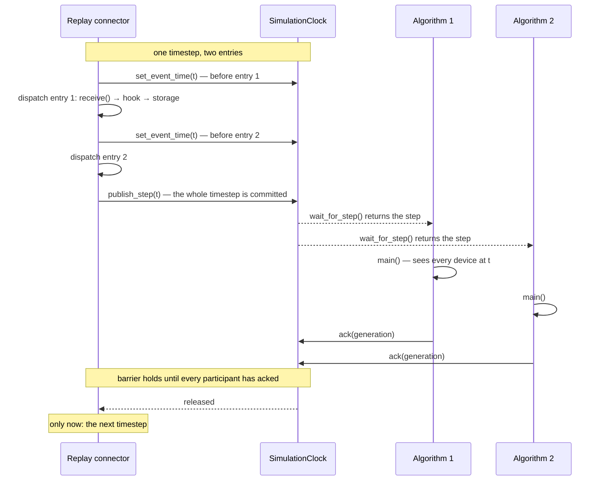

Motrix Edge can replay a recorded file through the same algorithms that run live, and produce the same output every time. That guarantee rests on three mechanisms — two clocks, a barrier, and one line of config resolution — all of which live in [`simulation/clock.py`](https://github.com/Motrix-Energy/motrix-edge/blob/main/simulation/clock.py) and [`connectors/pseudo.py`](https://github.com/Motrix-Energy/motrix-edge/blob/main/connectors/pseudo.py). This page explains why each exists.

## Two clocks, because one value cannot serve both readers

Under a replay, "now" means two different things depending on who is asking:

- The **event clock** is the timestamp of the entry being dispatched *right now*. The replay advances it **before** each entry, so a storage backend writing a device reading stamps it with the moment that reading was produced — not the moment of the previous entry, and never the wall clock.
- The **committed step clock** is the last *completed* timestep. The replay advances it **after** the final entry of a timestep, so an algorithm woken by it sees every device at that timestep rather than a half-updated set. This is what `devices_manager.get_simulation_time()` returns, and it is what decisions are stamped with.

The distinction is not pedantry: a reading belongs to the timestep being dispatched, while a decision belongs to the timestep the algorithm was processing. Storage backends therefore derive timestamps from the framework's helpers — one per clock — and never from `datetime.now()`, or a backtest would be stamped with the wall clock. The helpers are covered in the [storage recipe](/contribute/storage-and-services/).

## The lockstep barrier

On top of the step clock sits a barrier. Every algorithm joins it as a participant, and acknowledges every step it finishes; the replay connector, after committing a timestep, **blocks until every participant has acknowledged it** before dispatching the next one.

This is what `speed: 0` actually means. It does *not* mean "as fast as the file reads" — it means **as fast as the algorithms allow**. A slow `main()` slows the backtest down; it can never cause the replay to run ahead, read devices from a later timestep than the one it stepped on, or skip timesteps outright. Without the barrier, all three happened.



The barrier degrades loudly rather than silently. A step that overruns `step_timeout_seconds` (default 30s) is logged — first occurrence at ERROR — and the replay advances anyway, with the message stating plainly that the backtest is no longer deterministic. A determinism guarantee that silently stopped holding would be worse than a run that is visibly stuck.

A crash does not open the barrier either. An algorithm whose `main()` raises stays a participant while the supervisor backs off and restarts it, so the replay waits at the next timestep rather than running ahead — the step it died on is acknowledged and never re-run, and none after it is skipped. It leaves the barrier only when the supervisor gives up on it ([Lifecycle](/architecture/lifecycle/)). A backoff longer than `step_timeout_seconds` still ends in the loud timeout above.

## Why one `main()` backtests and runs live unchanged

An algorithm's base `loop()` chooses its cadence per iteration: when a replay connector drives the clock, it steps `main()` once per committed timestep; otherwise it runs on a `delay_seconds` wall-clock cadence. The algorithm's own code contains nothing about time or transport — it reads the current moment through `get_simulation_time()`, which is stable for the whole of one `main()`.

The consequence is the project's core promise: the code you backtested is byte-for-byte the code you deploy. There is no "simulation mode" flag to forget, no second code path to drift. `tests/test_replay_determinism.py` pins the lockstep and stamping behaviour; byte-reproducibility of a whole run is checked separately by `python examples/generate.py --check`.

## `emulates`: any device is backtestable

A device dispatches its parsing on the protocol its connector speaks — `receive()` reads `self.connector_options["protocol"]`, injected by `Config` from the connector the device is wired to. So what does a P1 meter see when it is wired to a replay instead of a broker?

Exactly what it would see live. A replay connector declares which transport it stands in for:

```json
{
	"name": "replay",
	"protocol": "pseudo",
	"options": {
		"replay_file": "examples/auto_toggle/replay.naive.csv",
		"speed": 0,
		"emulates": "mqtt"
	}
}
```

[`config/config.py`](https://github.com/Motrix-Energy/motrix-edge/blob/main/config/config.py) resolves each device's protocol as *`emulates` if declared, else the connector's own `protocol`* — so a `p1` or `shelly_plug` device attached to this replay is told `mqtt`, takes its normal parse path, and never learns it is being replayed. Payloads reach it byte for byte, strings in and strings out, which is the same contract every live connector honours. The result: **any device is backtestable through a replay file with no replay-only branch in its code**, and the backtest exercises the production parser rather than a stand-in.

This is also the capture-then-backtest workflow for real hardware: record what a live connector received, replay it with the matching `emulates`, and debug the parse on a machine with no radio, broker or Modbus stack at all — see [Connecting real hardware](/operate/hardware/).

:::note[Every option, documented at the source]
Both replay file formats and every speed mode are documented option by option in [`connectors/pseudo.schema.json`](https://github.com/Motrix-Energy/motrix-edge/blob/main/connectors/pseudo.schema.json).
:::

## Where to next

- See it run: the [quickstart](/start/quickstart/) is a replay driving `AutoToggle` through twelve timesteps in about a second.
- Write one: the [algorithm recipe](/contribute/algorithms/) shows why an algorithm needs zero awareness of any of this.
- What the timestamps mean once written: [Storage format 1.0](/reference/storage-format/).
