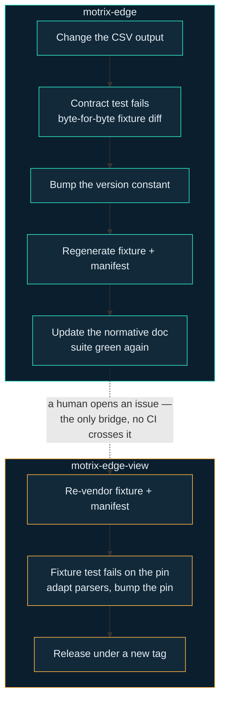

The two CSV files written by `csv_file` are the contract between two repositories in two languages: motrix-edge writes them, motrix-edge-view parses them. Each repo documents its own side, but the *procedure* for changing the format spans both — which is why it lives here, on the one site that sees the whole loop.

The contract itself is normative in [`docs/storage-format.md`](https://github.com/Motrix-Energy/motrix-edge/blob/main/docs/storage-format.md) in motrix-edge; a one-screen summary with the chart-trust caveats is on [/reference/storage-format/](/reference/storage-format/). This page is about what happens when you need to *change* it.

## MAJOR or MINOR

From the normative doc's [versioning section](https://github.com/Motrix-Energy/motrix-edge/blob/main/docs/storage-format.md#11-versioning):

| Bump | When |
|---|---|
| **MAJOR** | a header, column set or column order changes; the dialect changes; the timestamp format changes; or `data_json` / `command` change meaning |
| **MINOR** | additive only — a new column appended at the end, or a new optional file. A consumer built for `1.x` keeps working |

Note how little room MINOR leaves. Column *order* is part of the contract (a consumer that positionally indexes is entitled to rely on it), so even a reordering is MAJOR. If you are unsure which side of the line a change falls on, ask what a viewer built yesterday would do with a file written tomorrow — if the answer is anything but "work unchanged", it is MAJOR.

The version is deliberately **never written into a CSV**. A version row or comment line would break every naive `DictReader` and PapaParse consumer — exactly the audience the version exists to protect. A format version is a property of the writer, not of a row; it is published through `examples/MANIFEST.json`, which a consumer vendors alongside its copy of the fixture.

## The four pinned places

One version string lives in four places across the two repositories. That redundancy is the mechanism: bumping one without the others fails a test, on whichever side was forgotten.

| Where | Repository | What it is |
|---|---|---|
| `STORAGE_FORMAT_VERSION` in [`storage/csv_file.py`](https://github.com/Motrix-Energy/motrix-edge/blob/main/storage/csv_file.py) | motrix-edge | The source of truth — a constant next to the code that writes the files |
| [`examples/MANIFEST.json`](https://github.com/Motrix-Energy/motrix-edge/blob/main/examples/MANIFEST.json) | motrix-edge | The published version plus a SHA-256 checksum of every generated fixture file |
| The version line atop [`docs/storage-format.md`](https://github.com/Motrix-Energy/motrix-edge/blob/main/docs/storage-format.md) | motrix-edge | The human-readable copy in the normative document |
| `motrixStorageFormat` in [`package.json`](https://github.com/Motrix-Energy/motrix-edge-view/blob/main/package.json) | motrix-edge-view | What this viewer build targets |

On the Edge side, a lockstep assertion in [`tests/test_storage_contract.py`](https://github.com/Motrix-Energy/motrix-edge/blob/main/tests/test_storage_contract.py) pins the first three together, and the same test regenerates the golden fixture and compares it **byte-for-byte** — any format change fails CI before it can ship. On the View side, [`test/fixtures.test.ts`](https://github.com/Motrix-Energy/motrix-edge-view/blob/main/test/fixtures.test.ts) asserts `motrixStorageFormat` against the vendored manifest, so a re-vendored fixture with a new version fails the viewer's build until the pin is raised deliberately.

## The fixture is the interface

The prose in `docs/storage-format.md` is normative, but the *interface* is the golden fixture in `examples/` — real EMS output, regenerated by running the EMS itself via [`examples/generate.py`](https://github.com/Motrix-Energy/motrix-edge/blob/main/examples/generate.py), with `examples/MANIFEST.json` recording a SHA-256 for every generated file (the two CSVs, the two replay inputs and the `control.log`). The viewer vendors those same bytes into `test/fixtures/`, tracked in git, and verifies them against its copy of the manifest.

The fixture is deliberately adversarial rather than minimal: it is *two* runs appended to one directory — one with naive timestamps, one offset-aware — which is how it reproduces a single `timestamp` column holding two time domains, the sharpest edge in the whole format. Nested payloads, string-typed numbers, a register that disappears halfway through: the sample data exercises the corners a hand-written test file would politely avoid. If your change survives regeneration with the fixture unchanged, it was not a format change; if the bytes move, the contract moved, whether you meant it or not.

Two corollaries for contributors on either side:

- **Never edit fixture files by hand.** They are generated, and their checksums are pinned. On the Edge side the only legitimate write is `python examples/generate.py`; on the View side, `npm run fixtures:update`.
- **A MINOR change walks the same loop.** Additive or not, the fixture bytes and the manifest checksums change, so steps 1–7 all still apply — MINOR only changes what the viewer must *do* about it (tolerate, rather than adapt).

## The procedure

The loop starts with a failing test, and that is by design — you do not decide to synchronise, the fixture tells you to.

1. **Make the change** in `storage/csv_file.py` and run `pytest`. `tests/test_storage_contract.py` fails on the byte diff, and its failure message names the cross-repo consequence — including the repository that has to be told.
2. **Decide MAJOR or MINOR** (table above) and **bump `STORAGE_FORMAT_VERSION`** accordingly.
3. **Regenerate the fixture**: `python examples/generate.py` reruns the EMS over the example replay and rewrites the golden files and `examples/MANIFEST.json` — new checksums, new version.
4. **Update the normative doc**: the version line atop `docs/storage-format.md` and the section describing what changed. Run `pytest` again; the lockstep assertion is now satisfied and the suite is green.
5. **Open an issue on motrix-edge-view.** This is the human step — the only bridge between the repositories.
6. **In the viewer**: `npm run fixtures:update` re-vendors the fixture and manifest, `test/fixtures.test.ts` fails on the version pin, and the fix is deliberate — adapt the parsers to the change, then bump `motrixStorageFormat` in `package.json`.
7. **Release the viewer under a new tag.** The container tag is always explicit, never `:latest`, so no deployment picks up a viewer expecting the new format until an operator chooses it.

## Why the human step is a feature

There is no submodule between the repositories, no shared package, and no CI federation — cross-repository synchronisation is a deliberate human step triggered by a failing test and an issue. That is a decision, not a gap, and it buys three things:

- **Each repository stays independently buildable.** A contributor to the viewer clones one repo and runs `npm test` against tracked fixtures; no checkout of the EMS, no Python toolchain, no network. A submodule would make the most common contribution — a UI fix — depend on the least common toolchain.
- **The version boundary is inspectable.** The fixture and the manifest are ordinary tracked files; `git log` on either side shows exactly when the contract moved and what the bytes were before. CI federation would move that history into pipeline configuration, where nobody reads it.
- **Deployments cannot drift by accident.** The boundary an operator sees is the image tag — explicit, never `:latest` — so the moment the two sides speak different versions is always a moment somebody chose. A pipeline that auto-bumped the viewer on every Edge change would convert every format mistake into a same-day production incident on both sides.

The cost is that a person has to open an issue and another person has to act on it. The tests make forgetting loud on both sides — which is the property the whole mechanism is built around: **a format bump fails a test, never a chart.**

## When you end up here from the other side

If you are changing the *viewer's* parsers and the fixtures no longer parse, do not edit the fixtures — they are generated, and their checksums are pinned by the manifest. The change belongs upstream in motrix-edge, followed by this page's loop. The viewer-side rules for parser work are on [/contribute/viewer/](/contribute/viewer/); what a consumer must tolerate without a format change (timestamp domains, gaps, opaque commands) is summarised on [/reference/storage-format/](/reference/storage-format/).
