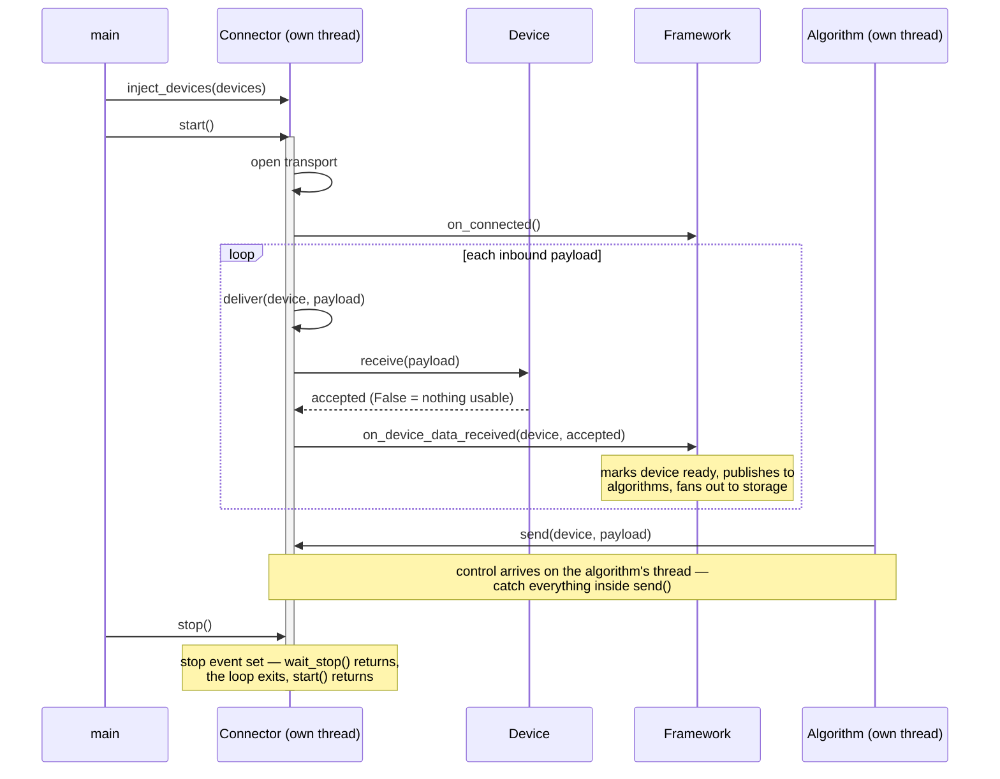

This page builds a working connector from nothing, using only the Python standard library, and every step is runnable as you go. By the end you will have a new transport plugin that the EMS loads from config with no registration code, feeds real devices, survives shutdown cleanly, ships an options schema, and — the part that matters — backtests through the same replay machinery as every shipped connector.

The connector we build is **`file_tail`**: it tails a plain text file of `device_name<TAB>payload` lines and feeds each payload to the device that claims that name. A file needs no broker, no socket and no hardware, so nothing here can fail for infrastructure reasons — which leaves all your attention for the contract itself. That contract is identical for MQTT, Modbus or a serial radio; only the transport code changes.

This walkthrough narrates the nine steps of the normative recipe, [CONTRIBUTING.md — Recipe: add a new connector](https://github.com/Motrix-Energy/motrix-edge/blob/main/CONTRIBUTING.md#recipe-add-a-new-connector). Where the two disagree, the repo wins. Set up a dev checkout first ([Contribution workflow](/contribute/workflow/)) and remember the house style: tabs, in Python and JSON alike.

## The shape of a connector's life

Everything you are about to write hangs off five hooks. `main` constructs your connector from config, injects its devices, and runs `start()` in a supervised daemon thread; your loop feeds devices and reports each result; `send()` arrives from outside, on an algorithm's thread; `stop()` asks your loop to end.



The full journey of one reading, from transport to algorithm decision, is traced on [Data flow: wire to decision](/architecture/data-flow/); the supervision rules — what happens when `start()` raises, returns, or ignores a stop request — live on [Lifecycle](/architecture/lifecycle/).

## Step 1 — Create the module and the class

Create `connectors/file_tail.py`:

```python
from typing import Optional, override

from api.connector import Connector
from api.device import Device


class FileTailConnector(Connector):
	"""Tails a text file of "device_name<TAB>payload" lines."""
```

The file name and the class name are doing real work here. There is no plugin registry in Motrix Edge: a config entry with `"protocol": "file_tail"` makes the loader import `connectors/file_tail.py` and look inside it for a class whose lowercased name is `filetailconnector` — module name, plus the axis suffix `Connector`, underscores stripped, matched case-insensitively. Name either half wrong and the plugin is rejected with a logged error; name both right and you are done wiring. The class must subclass `Connector` (`api/connector.py`), or it is rejected the same way.

*Normative source:* [Recipe: add a new connector, step 1](https://github.com/Motrix-Energy/motrix-edge/blob/main/CONTRIBUTING.md#recipe-add-a-new-connector) and [How plugins load](https://github.com/Motrix-Energy/motrix-edge/blob/main/CONTRIBUTING.md#how-plugins-load).

:::note[No optional dependencies here — by construction]
`file_tail` imports nothing outside the standard library, so we skip the recipe's step 2 entirely. The moment your real connector needs a library that is not in `requirements.txt`, where you import it decides whether a missing install is one clean per-entry skip or a crash loop that takes the whole run down. Read [the first footgun](/contribute/connector-patterns/) before you add one.
:::

## Step 2 — The constructor is the options schema

```python
	@override
	def __init__(self, name: str, path: str, poll_seconds: float = 1.0) -> None:
		super().__init__(name)
		self.path = path
		self.poll_seconds = poll_seconds
```

Three things to see, in order of importance.

**Call `super().__init__(name)` first.** It sets up `self.LOGGER` (a logger named `FileTailConnector/<name>`, the only way this codebase logs), stores `self.name`, and arms the cooperative-stop event that everything in step 4 depends on. Nothing in your constructor works safely before that line.

**The signature is the options schema.** The loader instantiates you as `FileTailConnector(entry["name"], **entry["options"])` — every key in the config entry's `options` object arrives as a keyword argument. `path` is required because it has no default; `poll_seconds` is optional because it does. An unknown key raises `TypeError` and the plugin is skipped with a *"could not be instantiated"* log line. You never parse options; you declare them.

**No I/O here.** The constructor runs on the main thread during startup, before any worker exists. Opening the file belongs in `start()`, where the supervisor can see a failure and where a slow filesystem cannot stall the whole boot. Store what config gave you and stop.

*Normative source:* [How plugins load — the kwargs contract](https://github.com/Motrix-Energy/motrix-edge/blob/main/CONTRIBUTING.md#how-plugins-load).

## Step 3 — Implement `start()`: the blocking loop

`start()` blocks for the life of the connector; `main` runs it in its own supervised daemon thread. Ours opens the file, announces the transport is up, then follows the file forever — reading lines that exist and polling for lines that do not yet:

```python
	@override
	def start(self) -> None:
		try:
			file = open(self.path, encoding="utf-8")
		except OSError as e:
			self.LOGGER.error(f"Cannot open {self.path}: {e}")
			return

		with file:
			self.on_connected()
			while not self.is_stopping():
				line = file.readline()
				if not line:
					self.wait_stop(self.poll_seconds)
					continue
				self._dispatch(line)

	def _dispatch(self, line: str) -> None:
		device_name, sep, payload = line.rstrip("\r\n").partition("\t")
		if not sep:
			self.LOGGER.warning(f"Skipping line with no tab separator: {line!r}")
			return
		device = self._device_for(device_name)
		if device is None:
			self.LOGGER.warning(f"No device listens for '{device_name}', skipping")
			return
		self.deliver(device, payload)

	def _device_for(self, device_name: str) -> Optional[Device]:
		for device in self.devices.values():
			if device.listener_options.get("name") == device_name:
				return device
		return None
```

Walk the dispatch path slowly, because it is the heart of every connector:

- **`self.on_connected()`, once, when the transport is up.** It marks write-only devices connected — a device that only receives commands has no inbound payload to prove the link is alive, so the connector vouches for it.
- **Routing goes through `device.listener_options`.** You received `self.devices` via `inject_devices()` before `start()` ran — it maps *config names* to `Device` objects. But the first column of our file is the *transport's* name for the source, and those are different vocabularies: `listener_options` is where each device declares what it listens for on your transport (a topic filter on MQTT, an endpoint on HTTP, a `name` key here). A connector that routed on config names would force every operator to name their devices after the wire. If the linear scan bothers you, precompute a lookup by overriding `inject_devices()` — call `super().inject_devices(devices)` first; `connectors/http_api.py` is the worked example.
- **Mirror the arity the device expects.** Our lines carry no topic, so we pass one argument. `PseudoConnector` does exactly the same when a replay row's topic column is empty, and passes `(topic, payload)` when it is not. That mirroring is what will make step 8's replay indistinguishable from the live run.
- **`self.deliver(device, payload)` is the only way to hand a device a payload.** It calls the device's `receive()`, forwards what came back to the framework hook — which marks the device connected and data-ready, publishes the snapshot to `DevicesManager` so algorithms see it, and fans the reading out to storage — and does both inside one guard. The value it forwards matters: a device returns `False` when the payload gave it nothing usable, and forwarding that is what keeps a corrupt frame out of storage, recorded as a gap rather than the previous reading republished under a fresh timestamp. [Data flow](/architecture/data-flow/) traces why a gap is the honest answer.
- **The guard is why it exists.** A device is contracted never to raise, but one that does used to end the whole run: the exception escaped your `start()`, the supervisor spent its restart budget, and `main` read the finished worker as "all connectors finished". `deliver()` logs that with its traceback, quietens the repeats, drops the reading and returns `False` — so branch on it if you track per-device failure state. Everything *your* code can raise still belongs in a narrow `except` of your own, because a bug of yours should reach the supervisor.
- **Sleep with `self.wait_stop(seconds)`, never `time.sleep(seconds)`.** A stop request interrupts `wait_stop` immediately; `time.sleep` waits it out and holds shutdown hostage for up to a full poll interval.

*Normative source:* [Recipe: add a new connector, step 3](https://github.com/Motrix-Energy/motrix-edge/blob/main/CONTRIBUTING.md#recipe-add-a-new-connector).

## Step 4 — Make it stoppable, and know what returning means

The framework never kills a thread. On shutdown it calls `stop()` — which sets the event behind `is_stopping()` and `wait_stop()` — and joins your thread within a bounded grace period. Our loop already cooperates: the `while` condition polls `is_stopping()`, and the only sleep is interruptible. Nothing more to write.

Two semantics are worth engraving now, because the supervisor treats them very differently:

- **Returning from `start()` is a clean finish.** It is logged and never restarted. That is why the `open()` failure above *returns* after logging — a missing file at startup is a configuration problem, and restarting into it five times helps nobody.
- **Raising from `start()` is a crash.** The supervisor logs the traceback at ERROR and restarts you with bounded exponential backoff; past the budget it logs CRITICAL and leaves you down. Raise on genuine failure, return when genuinely done. [Lifecycle](/architecture/lifecycle/) has the full state machine.

Our loop only ever blocks inside `wait_stop`, so the event alone unblocks it. A real transport is rarely so polite: a loop parked inside a foreign client's event loop — paho's, a serial read, an HTTP long poll — never sees the event. For that case, override `stop()` and make the transport eject you, always calling `super().stop()` first so the event is set before anything else happens:

```python
	@override
	def stop(self) -> None:
		super().stop()                  # always first: sets the stop event
		self.transport.disconnect()     # whatever makes start() return
```

*Normative source:* [Recipe: add a new connector, step 4](https://github.com/Motrix-Energy/motrix-edge/blob/main/CONTRIBUTING.md#recipe-add-a-new-connector) and [Contracts shared with the other axes](https://github.com/Motrix-Energy/motrix-edge/blob/main/CONTRIBUTING.md#contracts-shared-with-the-other-axes).

## Step 5 — Implement `send()`: the control path

`send(device, payload)` is invoked when an algorithm switches a device. Routing for the write direction lives in `device.controller_options` — ours names a file to append commands to:

```python
	@override
	def send(self, device: Device, payload: str) -> None:
		try:
			control_path = device.controller_options.get("control_file")
			if not control_path:
				self.LOGGER.warning(f"Device '{device.name}' has no controller_options.control_file, dropping command '{payload}'")
				return
			with open(control_path, "a", encoding="utf-8") as f:
				f.write(f"{device.name}\t{payload}\n")
			self.LOGGER.info(f"Delivered command '{payload}' to '{device.name}'")
		except Exception as e:
			self.LOGGER.error(f"Cannot deliver command '{payload}' to '{device.name}': {e}")
```

The `try` wrapping the *entire* body is not defensive habit — it is the contract. `send()` runs on the **algorithm's thread**, at the end of a call chain in which nothing catches, so an exception escaping here is counted as an algorithm crash: five restarts with backoff, then CRITICAL, because a file was read-only. Everything, coercion of the payload included, belongs inside the `try`. The mechanism, and the shipped connector that documents it line by line, are [the second footgun](/contribute/connector-patterns/).

*Normative source:* [Recipe: add a new connector, step 5](https://github.com/Motrix-Energy/motrix-edge/blob/main/CONTRIBUTING.md#recipe-add-a-new-connector).

## Step 6 — Ship the options schema

Create `connectors/file_tail.schema.json` — a standalone JSON Schema (draft 2020-12) whose keys match your constructor kwargs exactly. Copy [`connectors/pseudo.schema.json`](https://github.com/Motrix-Energy/motrix-edge/blob/main/connectors/pseudo.schema.json) as the template:

```json
{
	"$schema": "https://json-schema.org/draft/2020-12/schema",
	"$comment": "Options for the file_tail connector. Keys map 1:1 to FileTailConnector.__init__ kwargs — keep in lockstep with the constructor; tests/test_config.py enforces this.",
	"type": "object",
	"properties": {
		"path": {
			"type": "string"
		},
		"poll_seconds": {
			"type": "number",
			"minimum": 0
		}
	},
	"required": ["path"],
	"additionalProperties": false
}
```

`Config` validates every config entry with your protocol against this at load time — as warnings, never fatally, so a typo is named in the log before the `TypeError` would have skipped the plugin anyway. `additionalProperties: false` is what makes that warning arrive first and say something useful. The lockstep between schema and constructor is enforced by a test, and that test inspects **your** `__init__` — a detail that becomes a trap the day you subclass; it is [the third footgun](/contribute/connector-patterns/).

*Normative source:* [Recipe: add a new connector, step 7](https://github.com/Motrix-Energy/motrix-edge/blob/main/CONTRIBUTING.md#recipe-add-a-new-connector).

## Step 7 — Wire it up and run it

A runnable config, wiring one pseudo device to the new connector, with CSV storage so the run leaves evidence. Save it as `config.file_tail.json` in the repo root:

```json
{
	"$schema": "./config.schema.json",
	"version": "1.0.0",
	"connectors": [
		{
			"name": "kitchen_tail",
			"protocol": "file_tail",
			"options": {
				"path": "data/tail.txt",
				"poll_seconds": 0.5
			}
		}
	],
	"devices": [
		{
			"name": "pseudo_sensor",
			"kind": "pseudo",
			"options": {
				"connector_options": { "name": "kitchen_tail" },
				"listener_options": { "name": "pseudo_sensor" },
				"controller_options": {}
			}
		}
	],
	"storage": [
		{
			"name": "csv",
			"class": "csv_file",
			"options": {
				"output_dir": "data/storage"
			}
		}
	]
}
```

`connector_options.name` wires the device to your connector by config name; `listener_options.name` is the routing key your `_device_for()` matches against the file's first column. Run it:

```bash
mkdir -p data && touch data/tail.txt
python main.py --config config.file_tail.json
```

The log shows the plugin loading by naming convention, one device injected, and the connector settling into its poll loop. From a second terminal, feed it:

```bash
printf 'pseudo_sensor\t{"value": 21.5}\n' >> data/tail.txt
printf 'pseudo_sensor\t{"value": 22.0}\n' >> data/tail.txt
```

Each line becomes a `receive()`, a publication, and a row in `data/storage/device_data.csv`. The run stays alive because liveness is connector-shaped — `main` waits on connectors, and yours never returns. Stop it with Ctrl+C and watch step 4 pay off: the stop event interrupts `wait_stop`, the loop exits, `start()` returns, and shutdown completes inside the grace period.

*Normative source:* [Recipe: add a new connector, step 8](https://github.com/Motrix-Energy/motrix-edge/blob/main/CONTRIBUTING.md#recipe-add-a-new-connector).

## Step 8 — Tests

Every shipped connector was written by copying the test file whose transport shape matched. For `file_tail` there are two to read and one to respect from a distance:

- [`tests/test_pseudo_connector.py`](https://github.com/Motrix-Energy/motrix-edge/blob/main/tests/test_pseudo_connector.py) — the file-driven shape, and the closest match: write a temp file, inject stub devices, run `start()`, assert the `receive()` calls. Your happy path, your malformed-line path and your unknown-device path all fit this mould.
- [`tests/test_lora_connector.py`](https://github.com/Motrix-Energy/motrix-edge/blob/main/tests/test_lora_connector.py) — the `TestStart` shape for a connector with a reconnecting loop: each degenerate configuration must make `start()` *return idle*, not loop and not raise. Copy its structure the day `file_tail` grows retry behaviour.
- [`tests/test_shutdown.py`](https://github.com/Motrix-Energy/motrix-edge/blob/main/tests/test_shutdown.py) — the template for proving `stop()` unblocks a blocked `start()` within a bounded timeout. Copy its *pattern* into your own test module — *never* add your connector to that file itself. The reason is [the fourth footgun](/contribute/connector-patterns/).

`pytest` must stay green with no hardware and no network — that bar is the whole test contract, and the [workflow page](/contribute/workflow/) holds you to it.

All three open with `from tests.conftest import …`, which resolves only inside a checkout of `motrix-edge`. The doubles and the threading harness they pull in live in [`api/testing.py`](https://github.com/Motrix-Energy/motrix-edge/blob/main/api/testing.py) and import from anywhere — `conftest.py` only re-exports them — so a connector living in its own repository can use the same shapes. The checks this repository runs over its own plugins are in [`api/conformance.py`](https://github.com/Motrix-Energy/motrix-edge/blob/main/api/conformance.py); `check_loads` is the one to run first, because it drives the real loader and catches the class-name and `issubclass` mistakes a schema check cannot see. Neither module is a supported API yet.

*Normative source:* [Recipe: add a new connector, step 9](https://github.com/Motrix-Energy/motrix-edge/blob/main/CONTRIBUTING.md#recipe-add-a-new-connector).

## Step 9 — Prove the backtest path

A connector is not finished when it moves live data; it is finished when a capture of that data replays through the EMS *without the devices noticing*. That property — replayability — is what every regression fixture in the project stands on, and it costs one config file to prove.

Take the payloads your step-7 run stored and write them as a replay input, `data/replay.file_tail.csv` — the pseudo connector's format is `timestamp,device_name,topic,payload`, with `device_name` holding *config* names and the topic column empty, because your transport has none:

```csv
timestamp,device_name,topic,payload
2026-01-15T10:00:00,pseudo_sensor,,"{""value"": 21.5}"
2026-01-15T10:00:05,pseudo_sensor,,"{""value"": 22.0}"
```

Then swap only the connector in your config — the device entry does not change:

```json
{
	"connectors": [
		{
			"name": "replay",
			"protocol": "pseudo",
			"options": {
				"replay_file": "data/replay.file_tail.csv",
				"speed": 0,
				"emulates": "file_tail"
			}
		}
	],
	"devices": [
		{
			"name": "pseudo_sensor",
			"kind": "pseudo",
			"options": {
				"connector_options": { "name": "replay" },
				"listener_options": { "name": "pseudo_sensor" },
				"controller_options": {}
			}
		}
	]
}
```

Run it and the whole capture replays in well under a second. Two details make this exact:

- **An empty topic column replays as `device.receive(payload)`** — one argument, the same arity your live loop used in step 3. The device cannot tell the difference, which was the point of mirroring.
- **`emulates: "file_tail"` makes the replay impersonate your transport.** Devices dispatch on the protocol `Config` injects into their `connector_options`; under a plain pseudo connector they would see `"pseudo"`. Our pseudo device ignores protocol entirely, so this run works either way — but declare it anyway, because the day your capture feeds a real device with a real parser, `emulates` is what lets that device replay without a replay-only code path. [Time, replay and determinism](/architecture/time-and-replay/) explains the machinery underneath.

That is the full journey: a connector born from a naming convention, feeding devices through two hooks, stoppable by contract, schema-checked, tested, and now backtestable. The pull request that ships it also adds a row to the [plugin catalogue](/reference/plugin-catalog/).

## Before you write the real one

`file_tail` never met the hard cases: an optional client library, a transport that reconnects, a subclassable protocol family. All five of the ways real connectors go wrong — and the subclassing doctrine that saves you writing most of yours — are on [Connector patterns and footguns](/contribute/connector-patterns/). Read it before the first line of the real thing.
